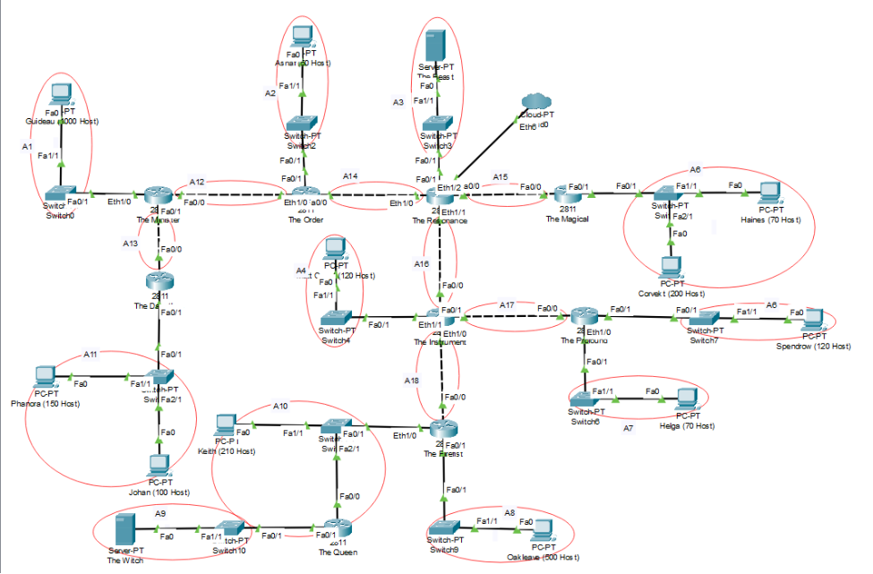

# soal-shift-jarkom-4-ITA01-2022

Repository Laporan Resmi Praktikum Jaringan Komputer Modul 4 Kelompok ITA01 Tahun 2022.

1. Damarhafni Rahmannabel Nadim P (5027201026)
2. Salman Al Farisi Sudirlan (5027201056)
3. I Putu Windy Arya Sagita (5027201071)

Kontribusi untuk modul ini sama rata (33.33% per orang).

# Daftar Isi

* [Daftar Isi](https://github.com/windyarya/Jarkom-Modul-4-ITA01-2022#daftar-isi)
* [Soal](https://github.com/windyarya/Jarkom-Modul-4-ITA01-2022#soal)
* [VLSM](https://github.com/windyarya/Jarkom-Modul-4-ITA01-2022#vlsm)
* [Jawaban VLSM](https://github.com/windyarya/Jarkom-Modul-4-ITA01-2022#jawaban-soal-vlsm)
* [CIDR](https://github.com/windyarya/Jarkom-Modul-4-ITA01-2022#cidr)
* [Jawaban CIDR](https://github.com/windyarya/Jarkom-Modul-4-ITA01-2022#jawaban-soal-cidr)

# Soal

Berikut merupakan soal topologi yang diberikan dimana kami diminta untuk menyelesaikannya dalam Subnetting dengan dua metode yaitu VLSM dan CIDR.

## Catatan
---
1. VLSM dikerjakan di Cisco Packet Tracer
2. CIDR dikerjakan di GNS3
3. Prefix IP menggunakan `10.40.0.0`

Detil soal dapat dilihat pada [tautan ini].(https://docs.google.com/document/d/1a_ITp6WYIqoJFXA2oL1jkox9AzqYGxicjr2LGPBsqBE/edit)

## VLSM
---
Buatlah penyelesaian subnetting dengan metode VLSM dari topologi yang diberikan!

## Jawaban Soal VLSM 
---
Pertama-tama kami membuat pembagian subnet terhadap topologi soal.

 

Dari hasil pembagian subnet diketahui terdapat sejumlah **18 Subnet**

### Perhitungan VLSM
1. Menentukan jumlah alamat IP yang dibutuhkan oleh tiap subnet dari 18 subnet yang ada 	

| Jumlah Host | Size | Alokasi | Netmask |   Subnet Mask   |    Address   |    Assignable IP Range    | Broadcast Address |
|:-----------:|:----:|:-------:|:-------:|:---------------:|:------------:|:-------------------------:|:-----------------:|
| A1          | 1001 | 1022    | /22     | 255.255.252.0   | 10.40.0.0    | 10.40.0.1-10.40.3.254     | 10.40.3.255       |
| A5          |  271 | 510     | /23     | 255.255.254.0   | 10.40.6.0    | 10.40.6.1-10.40.7.254     | 10.40.7.255       |
| A8          |  501 | 510     | /23     | 255.255.254.0   | 10.40.4.0    | 10.40.4.1-10.40.5.254     | 10.40.5.255       |
| A10         |  212 | 254     | /24     | 255.255.255.0   | 10.40.9.0    | 10.40.9.1-10.40.9.254     | 10.40.9.255       |
| A11         |  251 | 254     | /24     | 255.255.255.0   | 10.40.8.0    | 10.40.8.1-10.40.8.254     | 10.40.8.255       |
| A4          |  121 | 126     | /25     | 255.255.255.128 | 10.40.10.0   | 10.40.10.1-10.40.10.126   | 10.40.10.127      |
| A6          |  121 | 126     | /25     | 255.255.255.128 | 10.40.10.128 | 10.40.10.129-10.40.10.254 | 10.40.10.255      |
| A7          |   71 | 126     | /25     | 255.255.255.128 | 10.40.11.0   | 10.40.11.1-10.40.11.126   | 10.40.11.127      |
| A2          |   51 | 62      | /26     | 255.255.255.192 | 10.40.11.128 | 10.40.11.129-10.40.11.190 | 10.40.11.191      |
| A12         |    2 | 2       | /30     | 255.255.255.252 | 10.40.11.200 | 10.40.11.201-10.40.11.202 | 10.40.11.203      |
| A13         |    2 | 2       | /30     | 255.255.255.252 | 10.40.11.204 | 10.40.11.205-10.40.11.206 | 10.40.11.207      |
| A14         |    2 | 2       | /30     | 255.255.255.252 | 10.40.11.208 | 10.40.11.209-10.40.11.210 | 10.40.11.211      |
| A15         |    2 | 2       | /30     | 255.255.255.252 | 10.40.11.212 | 10.40.11.213-10.40.11.214 | 10.40.11.215      |
| A16         |    2 | 2       | /30     | 255.255.255.252 | 10.40.11.216 | 10.40.11.217-10.40.11.218 | 10.40.11.219      |
| A17         |    2 | 2       | /30     | 255.255.255.252 | 10.40.11.220 | 10.40.11.221-10.40.11.222 | 10.40.11.223      |
| A18         |    2 | 2       | /30     | 255.255.255.252 | 10.40.11.224 | 10.40.11.225-10.40.11.226 | 10.40.11.227      |
| A3          |    2 | 2       | /30     | 255.255.255.252 | 10.40.11.192 | 10.40.11.193-10.40.11.194 | 10.40.11.195      |
| A9          |    2 | 2       | /30     | 255.255.255.252 | 10.40.11.196 | 10.40.11.197-10.40.11.198 | 10.40.11.199      |
| Total       | 2618 |         | /20     |                 |              |                           |                   |