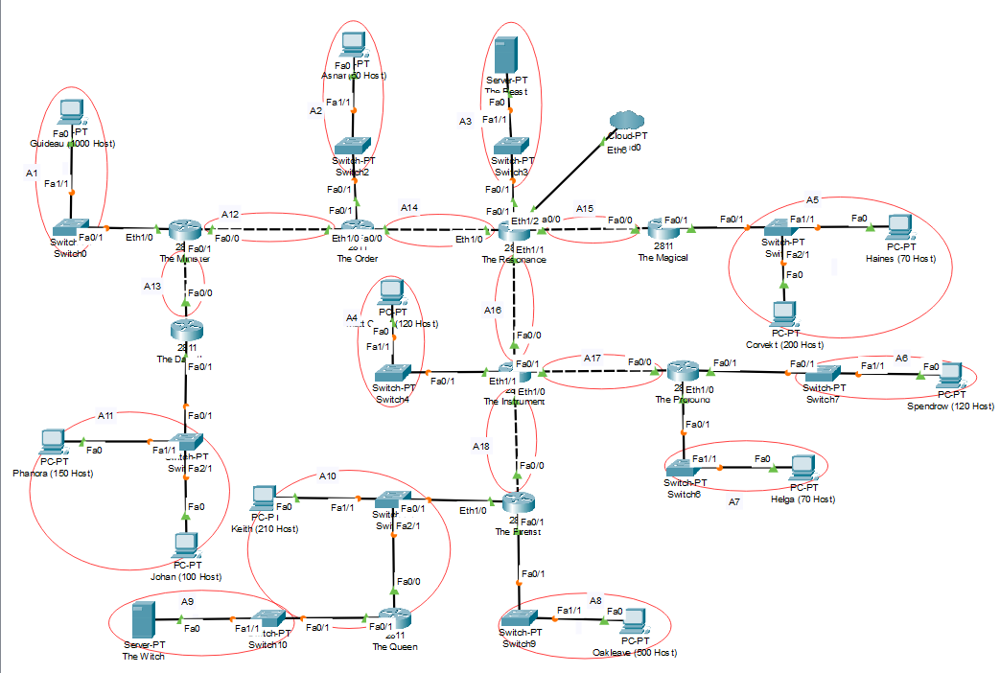
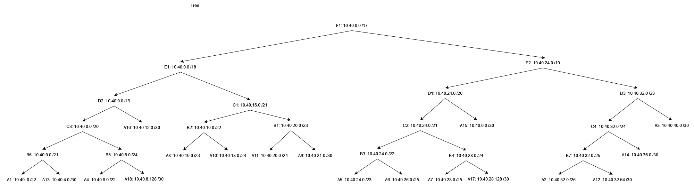

# Jarkom-Modul-4-ITA01-2022

Repository Laporan Resmi Praktikum Jaringan Komputer Modul 4 Kelompok ITA01 Tahun 2022.

1. Damarhafni Rahmannabel Nadim P (5027201026)
2. Salman Al Farisi Sudirlan (5027201056)
3. I Putu Windy Arya Sagita (5027201071)

Kontribusi untuk modul ini sama rata (33.33% per orang).

# Daftar Isi

- [Daftar Isi](https://github.com/windyarya/Jarkom-Modul-4-ITA01-2022#daftar-isi)
- [Soal](https://github.com/windyarya/Jarkom-Modul-4-ITA01-2022#soal)
- [VLSM](https://github.com/windyarya/Jarkom-Modul-4-ITA01-2022#vlsm)
	- [Jawaban VLSM](https://github.com/windyarya/Jarkom-Modul-4-ITA01-2022#jawaban-soal-vlsm)
	- [Kendala VLSM](https://github.com/windyarya/Jarkom-Modul-4-ITA01-2022#kendala-vlsm)
- [CIDR](https://github.com/windyarya/Jarkom-Modul-4-ITA01-2022#cidr)
	- [Jawaban CIDR](https://github.com/windyarya/Jarkom-Modul-4-ITA01-2022#jawaban-soal-cidr)
	- [Kendala CIDR](https://github.com/windyarya/Jarkom-Modul-4-ITA01-2022#kendala-cidr)

# Soal

Berikut merupakan soal topologi yang diberikan dimana kami diminta untuk menyelesaikannya dalam Subnetting dengan dua metode yaitu VLSM dan CIDR.


## Catatan
---
1. VLSM dikerjakan di Cisco Packet Tracer
2. CIDR dikerjakan di GNS3
3. Prefix IP menggunakan `10.40.0.0`

Detil soal dapat dilihat pada [tautan ini](https://docs.google.com/document/d/1a_ITp6WYIqoJFXA2oL1jkox9AzqYGxicjr2LGPBsqBE/edit)

## VLSM
---
Buatlah penyelesaian subnetting dengan metode VLSM dari topologi yang diberikan!

## Jawaban Soal VLSM 
---
Pertama-tama kami membuat pembagian subnet terhadap topologi soal.


<br>

Dari hasil pembagian subnet diketahui terdapat sejumlah **18 Subnet**

### Perhitungan VLSM

#### 1. Menentukan Jumlah IP tiap Subnet.

Menentukan jumlah alamat IP yang dibutuhkan oleh tiap subnet dari 18 subnet yang ada 	

| Jumlah Host | Size | Alokasi | Netmask |   Subnet Mask   |    Address   |    Assignable IP Range    | Broadcast Address |
|:-----------:|:----:|:-------:|:-------:|:---------------:|:------------:|:-------------------------:|:-----------------:|
| A1          | 1001 | 1022    | /22     | 255.255.252.0   | 10.40.0.0    | 10.40.0.1-10.40.3.254     | 10.40.3.255       |
| A5          |  271 | 510     | /23     | 255.255.254.0   | 10.40.6.0    | 10.40.6.1-10.40.7.254     | 10.40.7.255       |
| A8          |  501 | 510     | /23     | 255.255.254.0   | 10.40.4.0    | 10.40.4.1-10.40.5.254     | 10.40.5.255       |
| A11         |  251 | 254     | /24     | 255.255.255.0   | 10.40.8.0    | 10.40.8.1-10.40.8.254     | 10.40.8.255       |
| A10         |  212 | 254     | /24     | 255.255.255.0   | 10.40.9.0    | 10.40.9.1-10.40.9.254     | 10.40.9.255       |
| A4          |  121 | 126     | /25     | 255.255.255.128 | 10.40.10.0   | 10.40.10.1-10.40.10.126   | 10.40.10.127      |
| A6          |  121 | 126     | /25     | 255.255.255.128 | 10.40.10.128 | 10.40.10.129-10.40.10.254 | 10.40.10.255      |
| A7          |   71 | 126     | /25     | 255.255.255.128 | 10.40.11.0   | 10.40.11.1-10.40.11.126   | 10.40.11.127      |
| A2          |   51 | 62      | /26     | 255.255.255.192 | 10.40.11.128 | 10.40.11.129-10.40.11.190 | 10.40.11.191      |
| A3          |    2 | 2       | /30     | 255.255.255.252 | 10.40.11.192 | 10.40.11.193-10.40.11.194 | 10.40.11.195      |
| A9          |    2 | 2       | /30     | 255.255.255.252 | 10.40.11.196 | 10.40.11.197-10.40.11.198 | 10.40.11.199      |
| A12         |    2 | 2       | /30     | 255.255.255.252 | 10.40.11.200 | 10.40.11.201-10.40.11.202 | 10.40.11.203      |
| A13         |    2 | 2       | /30     | 255.255.255.252 | 10.40.11.204 | 10.40.11.205-10.40.11.206 | 10.40.11.207      |
| A14         |    2 | 2       | /30     | 255.255.255.252 | 10.40.11.208 | 10.40.11.209-10.40.11.210 | 10.40.11.211      |
| A15         |    2 | 2       | /30     | 255.255.255.252 | 10.40.11.212 | 10.40.11.213-10.40.11.214 | 10.40.11.215      |
| A16         |    2 | 2       | /30     | 255.255.255.252 | 10.40.11.216 | 10.40.11.217-10.40.11.218 | 10.40.11.219      |
| A17         |    2 | 2       | /30     | 255.255.255.252 | 10.40.11.220 | 10.40.11.221-10.40.11.222 | 10.40.11.223      |
| A18         |    2 | 2       | /30     | 255.255.255.252 | 10.40.11.224 | 10.40.11.225-10.40.11.226 | 10.40.11.227      |
| Total       | 2618 |         | /20     |                 |              |                           |                   |

#### 2. Menggambarkan Tree

Subnet besar yang kami bentuk memiliki NID 10.40.0.0 dengan netmask /20. Lalu, kita mulai dengan perhitungan pembagian IP dengan bantuan pohon IP seperti gambar berikut:<br>


#### 3. Setting IP

Setting IP ke seluruh node sesuai dengan pembagian IP yang sudah dilakukan sebelumnya. Di sini kami mencontohkan setting IP pada subnet A3.

- The Resonance: Router yang tersambung langsung ke internet.
	- IP pada interface FastEthernet0/0 (Fa0/0) yang mengarah ke Cloud.
	Untuk Interface ini, kita tidak perlu mengassign IP apapun.

	

	- IP pada interface FastEthernet1/0 (Fa1/0) yang mengarah ke Server The Beast.
	
	

	- IP pada interface Ethernet1/0 (Eth1/0) yang mengarah ke Router The Order.

	

	- IP pada interface Ethernet1/1 (Eth1/1) yang mengarah ke Router The Instrument.

	

	- IP pada interface Ethernet1/2 (Eth1/2) yang mengarah ke Router The Magical.

	

- The Beast: Server yang merupakan subnet A3.
	- IP pada interface FastEthernet0 (Fa0) yang mengarah ke router The Resonance. 

	

Di atas adalah setting IP pada subnet A3. Untuk subnet lainnya dilakukan dengan cara yang sama. Lebih jelasnya dapat dilihat langsung pada packet tracer [berikut](https://github.com/404.html).

#### 4. Routing

Setting routing pada seluruh router yang ada. Pada setiap router nantinya akan dirouting dengan seluruh subnet yang ada di bawahnya sehingga nantinya seluruh node bisa saling terhubung.

- Router The Resonance.

Berikut adalah subnet yang harus dimasukkan dalam routing pada router The Resonance.

1. Subnet via The Order

Nantinya akan terhubung via IP The Order yang menuju The Resonance.

```txt
Subnet A1:
	Network: 10.40.0.0
	Netmask: 255.255.252.0
	Next Hop: 10.40.11.210
Subnet A2:
	Network: 10.40.11.128
	Netmask: 255.255.255.192
	Next Hop: 10.40.11.210
Subnet A12:
	Network: 10.40.11.200
	Netmask: 255.255.255.252
	Next Hop: 10.40.11.210
Subnet A13:
	Network: 10.40.11.204
	Netmask: 255.255.255.252
	Next Hop: 10.40.11.210
Subnet A11:
	Network: 10.40.8.0
	Netmask: 255.255.255.0
	Next Hop: 10.40.11.210
```

2. Subnet via The Magical

Nantinya akan terhubung via IP The Magical yang menuju The Resonance.

```txt
Subnet A5:
	Network: 10.40.6.0
	Netmask: 255.255.254.0
	Next Hop: 10.40.11.210
```

3. Subnet via The Instrument

Nantinya akan terhubung via IP The Instrument yang menuju The Resonance.

```txt
Subnet A4:
	Network: 10.40.10.0
	Netmask: 255.255.255.128
	Next Hop: 10.40.11.218
Subnet A17:
	Network: 10.40.11.220
	Netmask: 255.255.255.252
	Next Hop: 10.40.11.218
Subnet A6:
	Network: 10.40.10.128
	Netmask: 255.255.255.128
	Next Hop: 10.40.11.218
Subnet A7:
	Network: 10.40.11.0
	Netmask: 255.255.255.128
	Next Hop: 10.40.11.218
Subnet A18:
	Network: 10.40.11.224
	Netmask: 255.255.255.252
	Next Hop: 10.40.11.218
Subnet A10:
	Network: 10.40.9.0
	Netmask: 255.255.255.0
	Next Hop: 10.40.11.218
Subnet A9:
	Network: 10.40.11.196
	Netmask: 255.255.255.252
	Next Hop: 10.40.11.218
Subnet A8:
	Network: 10.40.4.0
	Netmask: 255.255.254.0
	Next Hop: 10.40.11.218
```

Berikut adalah screenshot routing pada The Resonance.


- Router The Order.

Pada router The Order kita akan menghubungkan subnet yang berada di bawah router. Nantinya subnet-subnet tersebut akan terhubung via IP The Minister yang menuju ke The Order. 

Agar bisa terhubung dengan internet, nantinya perlu untuk mengatur routing dengan network `0.0.0.0`, netmask `0.0.0.0` via IP interface dari Resonance yang menuju ke Order dalam hal ini `10.40.11.209`.

Berikut adalah routing selengkapnya.

```txt
Internet:
	Network: 0.0.0.0
	Netmask: 0.0.0.0
	Next Hop: 10.40.11.209
Subnet A1:
	Network: 10.40.0.0
	Netmask: 255.255.252.0
	Next Hop: 10.40.11.202
Subnet A13:
	Network: 10.40.11.204
	Netmask: 255.255.255.252
	Next Hop: 10.40.11.202
Subnet A11:
	Network: 10.40.8.0
	Netmask: 255.255.255.0
	Next Hop: 10.40.11.202
```

Berikut adalah screenshot routing pada The Resonance.


- Router The Minister.

Pada router The Minister kita akan menghubungkan subnet yang berada di bawah router. Nantinya subnet-subnet tersebut akan terhubung via IP The Dauntless yang menuju ke The Minister. 

Agar bisa terhubung dengan internet, nantinya perlu untuk mengatur routing dengan network `0.0.0.0`, netmask `0.0.0.0` via IP interface dari Order yang menuju ke Minister dalam hal ini `10.40.11.209`.

Berikut adalah routing selengkapnya.

```txt
Internet:
	Network: 0.0.0.0
	Netmask: 0.0.0.0
	Next Hop: 10.40.11.201
Subnet A11:
	Network: 10.40.8.0
	Netmask: 255.255.255.0
	Next Hop: 10.40.11.206
```

Berikut adalah screenshot routing pada The Resonance.


- Router The Dauntless.

Karena pada router The Dauntless ini tidak memiliki subnet di bawahnya lagi yang terhubung secara tidak langsung sehingga untuk routing kita hanya perlu untuk mengatur routing internetnya saja. Untuk mengatur routing internet adalah dengan network `0.0.0.0`, netmask `0.0.0.0` via IP interface dari Minister yang menuju ke Dauntless dalam hal ini `10.40.11.205`.

Berikut adalah routing selengkapnya.

```txt
Internet:
	Network: 0.0.0.0
	Netmask: 0.0.0.0
	Next Hop: 10.40.11.205
```

Berikut adalah screenshot routing pada The Resonance.


- Router The Magical.

Karena pada router The Magical ini tidak memiliki subnet di bawahnya lagi yang terhubung secara tidak langsung sehingga untuk routing kita hanya perlu untuk mengatur routing internetnya saja. Untuk mengatur routing internet adalah dengan network `0.0.0.0`, netmask `0.0.0.0` via IP interface dari Resonance yang menuju ke Magical dalam hal ini `10.40.11.213`.

Berikut adalah routing selengkapnya.

```txt
Internet:
	Network: 0.0.0.0
	Netmask: 0.0.0.0
	Next Hop: 10.40.11.213
```

Berikut adalah screenshot routing pada The Magical.


- Router The Instrument.

Pada router The Instrument kita akan menghubungkan subnet yang berada di bawah router.

Agar bisa terhubung dengan internet, nantinya perlu untuk mengatur routing dengan network `0.0.0.0`, netmask `0.0.0.0` via IP interface dari Resonance yang menuju ke Instrument dalam hal ini `10.40.11.217`.

```txt
Internet:
	Network: 0.0.0.0
	Netmask: 0.0.0.0
	Next Hop: 10.40.11.217
```

1. Subnet via The Firefist

Nantinya akan terhubung via IP The Firefist yang menuju The Instrument.

```txt
Subnet A8:
	Network: 10.40.4.0
	Netmask: 255.255.254.0
	Next Hop: 10.40.11.226
Subnet A10:
	Network: 10.40.9.0
	Netmask: 255.255.255.0
	Next Hop: 10.40.11.226
Subnet A9:
	Network: 10.40.11.196
	Netmask: 255.255.255.252
	Next Hop: 10.40.11.226
```

2. Subnet via Profound

Nantinya akan terhubung via IP The Profound yang menuju The Instrument.

```txt
Subnet A6:
	Network: 10.40.10.128
	Netmask: 255.255.255.128
	Next Hop: 10.40.11.222
Subnet A7:
	Network: 10.40.11.0
	Netmask: 255.255.255.128
	Next Hop: 10.40.11.222
```

Berikut adalah screenshot routing pada The Instrument.


- Router The Firefist.

Pada router The Firefist kita akan menghubungkan subnet yang berada di bawah router. Nantinya subnet-subnet tersebut akan terhubung via IP The Queen yang menuju ke The Firefist. 

Agar bisa terhubung dengan internet, nantinya perlu untuk mengatur routing dengan network `0.0.0.0`, netmask `0.0.0.0` via IP interface dari Order yang menuju ke Minister dalam hal ini `10.40.11.225`.

Berikut adalah routing selengkapnya.

```txt
Internet:
	Network: 0.0.0.0
	Netmask: 0.0.0.0
	Next Hop: 10.40.11.225
Subnet A11:
	Network: 10.40.11.196
	Netmask: 255.255.255.252
	Next Hop: 10.40.9.3
```

Berikut adalah screenshot routing pada The Firefist.


- Router The Queen.

Karena pada router The Queen ini tidak memiliki subnet di bawahnya lagi yang terhubung secara tidak langsung sehingga untuk routing kita hanya perlu untuk mengatur routing internetnya saja. Untuk mengatur routing internet adalah dengan network `0.0.0.0`, netmask `0.0.0.0` via IP interface dari Firefist yang menuju ke Queen dalam hal ini `10.40.9.1`.

Berikut adalah routing selengkapnya.

```txt
Internet:
	Network: 0.0.0.0
	Netmask: 0.0.0.0
	Next Hop: 10.40.9.1
```

Berikut adalah screenshot routing pada The Queen.


- Router The Profound

Karena pada router The Profound ini tidak memiliki subnet di bawahnya lagi yang terhubung secara tidak langsung sehingga untuk routing kita hanya perlu untuk mengatur routing internetnya saja. Untuk mengatur routing internet adalah dengan network `0.0.0.0`, netmask `0.0.0.0` via IP interface dari Firefist yang menuju ke Queen dalam hal ini `10.40.11.221`.

Berikut adalah routing selengkapnya.

```txt
Internet:
	Network: 0.0.0.0
	Netmask: 0.0.0.0
	Next Hop: 10.40.11.221
```

Berikut adalah screenshot routing pada The Queen.


#### 5. Testing

Saat demo sudah ditesting sesuai dengan test yang diberikan oleh asisten. Hasilnya dari 15 test, 14 di antaranya berhasil. Satu yang tidak berhasil adalah test dari The Dauntless ke The Profound. Saat ini, kami sudah memperbaiki hal tersebut dan hasil tes sudah sukses. Berikut adalah beberapa tes yang kami lakukan.


## Kendala VLSM

- Awalnya kami sedikit kesulitan dalam melakukan routing, tapi pada akhirnya setelah membaca modul dan beberapa referensi, kami bisa menyelesaikan routing untuk VLSM.

## CIDR
---
Buatlah penyelesaian subnetting dengan metode CIDR dari topologi yang diberikan!

## Jawaban Soal CIDR 

### Perhitungan CIDR

#### 1. Menggabungkan Subnet

Di sini kami menggabungkan subnet-subnet yang ada menjadi subnet yang lebih besar. Berikut adalah penggabungannya.

- Subnet Awal: Subnet A


- Subnet B: Gabungan antar subnet A


- Subnet C: Gabungan antar subnet B (atau juga A)


- Subnet D: Gabungan antar subnet C (atau juga B)


- Subnet E: Gabungan antar subnet D (atau juga C)


- Subnet F: Gabungan antar subnet D (atau juga D)


Kemudian, untuk lebih jelasnya berikut adalah tabel penggabungan subnet-subnet tersebut.

| Subnet | Gabungan dari | Subnet Mask | 
|:------:|:-------------:|:-----------:|
|B1      |A11+A9         |/23          |
|B2      |A8+A10         |/22          |
|B3      |A5+A6          |/22          |
|B4      |A7+A17         |/24          |
|B5      |A4+A18         |/24          |
|B6      |A1+A13         |/21          |
|B7      |A2+A12         |/25          |
|C1      |B2+B1          |/21          |
|C2      |B3+B4          |/21          |
|C3      |B6+B5          |/20          |
|C4      |B7+A14         |/24          |
|D1      |C2+A15         |/20          |
|D2      |C3+A16         |/19          |
|D3      |C4+A3          |/23          |
|E1      |D2+C1          |/18          |
|E2      |D1+D3          |/19          |
|F1      |E1+E2          |/17          |

#### 2. Pembagian Tree

Berikut adalah pembagian tree dari penggabungan subnet yang sudah kami buat.



## Kendala CIDR

Kami masih kesulitan dalam melakukan routing pada GNS3.